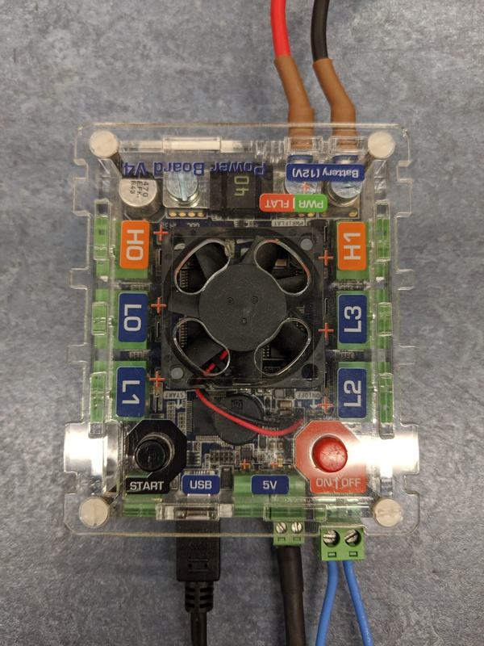
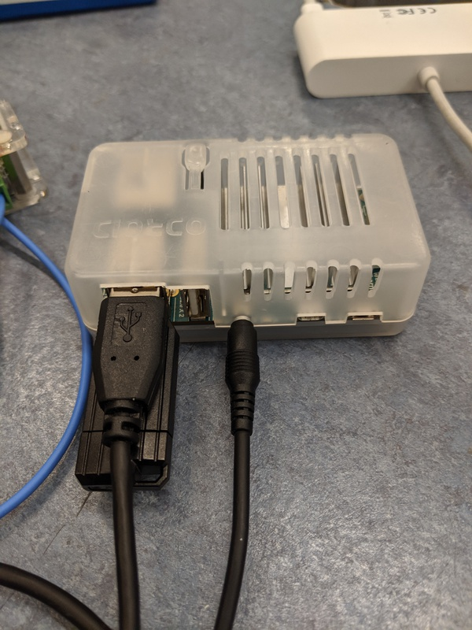

# ODROID Testing

## Equipment

 * Lipo battery
 * Power board (tested with a working buzzer)
 * Odroid
 * Power board on|off loop
 * Odroid power cable (make sure this is plugged in to a 5V port)
 * Micro USB cable
 * USB stick ([with the following code in a robot.zip](https://studentrobotics.org/docs/programming/getting_code_on_the_robot)):
    ``` python
    import time
    from sr.robot3 import Robot, Note
    
    R = Robot()
    
    while True:
        R.power_board.piezo.buzz(0.2, Note.A7)
        time.sleep(0.6)
    ```

Once assembled it should look like so:




## Procedure

*Execution time*: 1 minutes per board.

 1. Assemble minimal kit
 2. Insert USB stick into Odroid
 3. Turn on power board
 4. Wait for the start LED to flash
 5. Press the start button
 6. The power board should beep. If it does the Odroid is a pass, otherwise it is a fail.
